# 第二章 静电场：概念与课堂笔记

> 资料主线：教材第二章（印刷页 29–59，对应本地 PDF 页序 39–69）、《第二章 静电场》PPT 第 4–71 页，以及本轮学习对话中的疑问。章节顺序严格沿用课件：**2.1 基本物理量 → 2.2 基本规律 → 2.3 静电场的基本方程和边界条件** 。

本章所有物理矢量统一写成带箭头形式，例如 $\vec E$ 、 $\vec D$ 、 $\vec P$ 、 $\vec J$ 、 $\vec n$ 、 $d\vec S$ 和 $d\vec l$ 。

## 0. 全章主线

```text
2.1 基本物理量
电荷 → 电场强度 → 电偶极子 → 电介质极化 → 电容 → 电场能量
                  ↓
2.2 基本规律
有源（散度/高斯定理）+ 无旋（旋度/环路定理）+ 电荷守恒 + 库仑定律
                  ↓
介质中引入电位移矢量，把极化响应吸收到场量一侧
                  ↓
2.3 基本方程与边界条件
高斯方程 + 环路方程 + 本构关系
                  ↓
界面条件、导体表面条件、电位函数、泊松/拉普拉斯方程
```

学习时始终区分三件事：

- **源是什么：** 自由电荷、极化电荷，还是电流；
- **场量是什么：** $\vec E$ 、 $\vec D$ 、 $\vec P$ 或 $\vec J$ ；
- **公式的条件是什么：** 真空还是介质，静电还是时变，是否线性、均匀、各向同性，是否具有足够对称性。

---

## 1. 2.1 基本物理量

### 1.1 2.1.1 电荷及电荷密度

连续电荷分布用体、面、线电荷密度描述：

| 分布 | 定义 | 微元电荷 | 总电荷 | 单位 |
|---|---|---|---|---|
| 体分布 | $\rho=dq/dV$ | $dq=\rho dV$ | $q=\iiint_V\rho dV$ | $\mathrm{C/m^3}$ |
| 面分布 | $\rho_s=dq/dS$ | $dq=\rho_s dS$ | $q=\iint_S\rho_s dS$ | $\mathrm{C/m^2}$ |
| 线分布 | $\rho_l=dq/dl$ | $dq=\rho_l dl$ | $q=\int_L\rho_l dl$ | $\mathrm{C/m}$ |

这些密度都是标量，描述“电荷有多少、怎样分布”，不描述流动方向。点电荷、三类连续分布的建模条件和配图见[基础学习笔记](electrostatics-study-notes.md)。

### 1.2 2.1.2 电场强度与连续分布求场

电场强度定义为单位正试验电荷受到的力：

$$
\boxed{\vec E=\lim_{q_0\to0}\frac{\vec F}{q_0}}.
$$

连续电荷求场的母式是

$$
d\vec E
=\frac{1}{4\pi\varepsilon_0}
\frac{\vec R}{R^3}dq,
\qquad
\vec R=\vec r-\vec r'.
$$

然后按电荷分布写 $dq=\rho dV'$ 、 $\rho_s dS'$ 或 $\rho_l dl'$ ，最后积分。均匀带电有限直线、无限长直线和圆环轴线题的完整推导见[基础学习笔记](electrostatics-study-notes.md)。

> **此处提前使用，后文正式引入：** 上式来自库仑定律与叠加原理；课件为了先建立 $\vec E$ 的计算方法，在 2.1.2 已经使用它们，2.2.3 再正式归纳库仑定律。

### 1.3 2.1.3 电偶极子

电偶极子由相距很近的两个等量异号点电荷 $+q$ 、 $-q$ 组成。若从负电荷指向正电荷的位移矢量为 $\vec l$ ，则电偶极矩为

$$
\boxed{\vec p=q\vec l}.
$$

方向一定从 $-q$ 指向 $+q$ 。当场点距偶极子中心满足 $r\gg l$ 时，远区电位为

$$
\boxed{
\varphi(\vec r)
=\frac{1}{4\pi\varepsilon_0}
\frac{\vec p\cdot\vec r}{r^3}
=\frac{p\cos\theta}{4\pi\varepsilon_0r^2}
}.
$$

远区电场为

$$
\boxed{
\vec E(\vec r)
=\frac{1}{4\pi\varepsilon_0r^3}
\left[3(\vec p\cdot\vec e_r)\vec e_r-\vec p\right]
}.
$$

若 $\vec p$ 沿球坐标极轴，则

$$
\vec E
=\frac{p}{4\pi\varepsilon_0r^3}
\left(2\cos\theta\,\vec e_r+\sin\theta\,\vec e_\theta\right).
$$

点电荷的场按 $1/r^2$ 衰减，偶极子远区场按 $1/r^3$ 衰减；原因是偶极子的总电荷为零，最低阶非零项衰减更快。

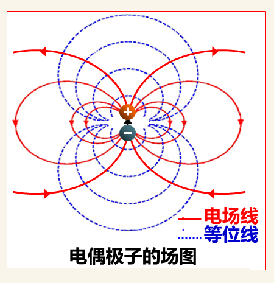

> 图 2-1　红色实线为电场线，蓝色虚线为等位线，两族曲线处处正交。来源：《第二章 静电场》PPT 第 23 页局部裁图。
> **此处提前使用，后文正式引入：** 本节用 $\vec E=-\nabla\varphi$ 从偶极子电位求远区电场；电位函数、梯度关系和电位方程在 2.3.3 正式建立。

**适用条件与易错点：**

- 上述紧凑公式是 $r\gg l$ 时的远区近似，近区应从两个点电荷的精确叠加式出发。
- $\vec p$ 是偶极子取向，不是空间各点 $\vec E$ 的统一方向。
- 赤道面上 $\varphi=0$ ，不等于 $\vec E=\vec 0$ ；零电位与零场强不是一回事。

### 1.4 2.1.4 电介质的极化

无极分子在外电场下，束缚正、负电荷中心发生微小相对位移，形成感生偶极矩，称为**位移极化** 。有极分子本来就有固有偶极矩，外场使其取向趋于电场方向，称为**取向极化** 。

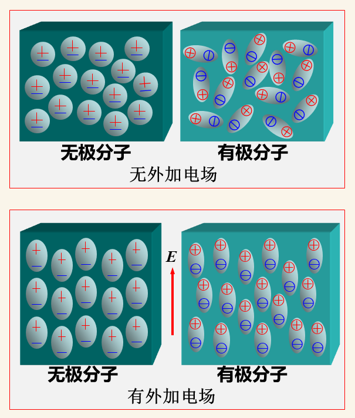

> 图 2-2　左列为位移极化，右列为取向极化；上、下分别表示无外场和有外场。来源：《第二章 静电场》PPT 第 24 页局部裁图。
极化强度定义为单位体积内分子电偶极矩的矢量和：

$$
\boxed{
\vec P
=\lim_{\Delta V\to0}
\frac{\sum_k\vec p_k}{\Delta V}
}.
$$

$\vec P$ 的单位为 $\mathrm{C/m^2}$ 。在线性、各向同性电介质中，

$$
\boxed{\vec P=\varepsilon_0\chi_e\vec E},
$$

其中 $\chi_e$ 为电极化率。该比例关系不适用于一般非线性或各向异性介质。

极化后可能产生束缚体电荷和束缚面电荷：

$$
\boxed{\rho_p=-\nabla\cdot\vec P},
\qquad
\boxed{\rho_{ps}=\vec P\cdot\vec n}.
$$

这里 $\vec n$ 必须取介质表面的外法向。 $\rho_p$ 、 $\rho_{ps}$ 是极化产生的束缚电荷； $\rho$ 、 $\rho_s$ 在介质中高斯方程和边界条件里通常表示自由电荷。

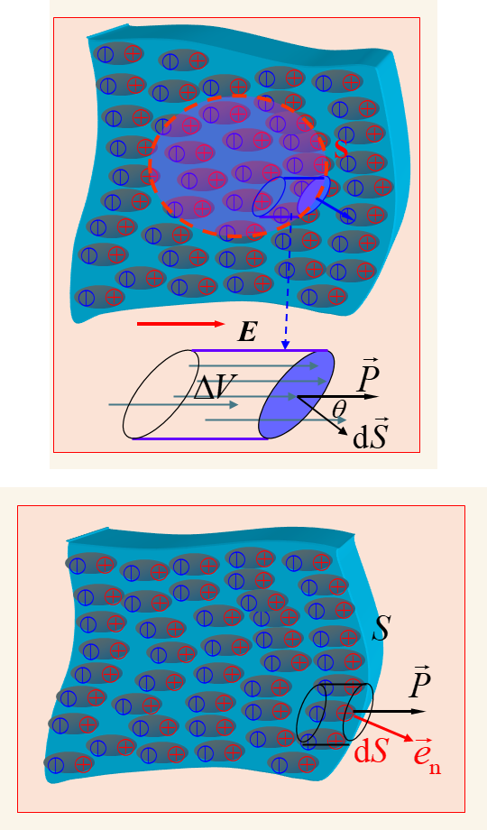

> 图 2-3　上图说明闭合面内净极化电荷来自穿过面的偶极子；下图说明介质表面的极化面电荷由 $\vec P$ 的外法向分量决定。来源：《第二章 静电场》PPT 第 26、27 页局部裁图并上下合并。
**易错点：**

- 均匀极化时 $\nabla\cdot\vec P=0$ ，内部没有极化体电荷，但表面仍可能有极化面电荷。
- 判断 $\rho_{ps}$ 正负前必须先画 $\vec n$ ； $\vec P$ 与 $\vec n$ 同向时为正，反向时为负。
- “极化电荷受束缚”不等于它不产生电场；自由电荷和极化电荷都服从库仑定律。

### 1.5 2.1.5 静电力

课件给出用虚位移法计算复杂导体系统静电力的思路，并区分常电位系统与常电荷系统。由于本轮课堂没有展开这一节，笔记只保留章节位置和判断原则，不补写超出课堂范围的推导与例题。

### 1.6 2.1.6 电容

孤立导体以无穷远为零电位时，电容定义为

$$
\boxed{C=\frac{q}{\varphi}}.
$$

两个带等量异号电荷的导体构成电容器时，

$$
\boxed{C=\frac{q}{U}}
$$

其中 $U=|\varphi_1-\varphi_2|$ 。在线性介质中，电容只由导体的形状、尺寸、相互位置和周围介质决定，与当前 $q$ 、 $U$ 的取值无关。

#### 双导体电容的两条计算路线

**路线一：从电荷到电压**

$$
\boxed{q\longrightarrow\vec E\longrightarrow U\longrightarrow C}.
$$

先假定两导体带 $+q$ 、 $-q$ ，由高斯定理或叠加原理求 $\vec E$ ，再计算

$$
U=\int_{\text{高电位}}^{\text{低电位}}\vec E\cdot d\vec l,
$$

最后用 $C=q/U$ 。

**路线二：从电位到电荷**

$$
\boxed{U\longrightarrow\varphi\longrightarrow\vec E\longrightarrow\rho_s\longrightarrow q\longrightarrow C}.
$$

给定导体电位，求 $\varphi$ ，再用 $\vec E=-\nabla\varphi$ 、 $\vec D=\varepsilon\vec E$ 和 $\rho_s=\vec D\cdot\vec n$ 得到电荷。

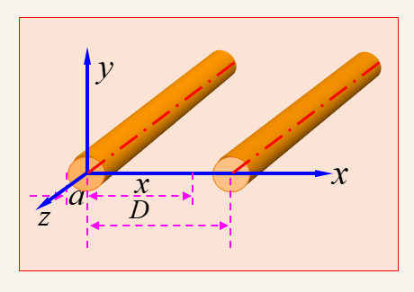

> 图 2-4　平行双线导线半径为 $a$ ，轴线间距为 $D$ 。来源：《第二章 静电场》PPT 第 32 页局部裁图。
当 $D\gg a$ 时，平行双线单位长度电容可近似写为

$$
C'
=\frac{\pi\varepsilon}{\ln[(D-a)/a]}
\approx\frac{\pi\varepsilon}{\ln(D/a)}.
$$

近似成立的关键是 $D\gg a$ ，此时才可把每根导线近似为轴线上的无限长线电荷。

#### 多导体系统：电位系数、电容系数、部分电容

若有 $N$ 个导体，电位系数定义为

$$
\boxed{
\varphi_i=\sum_{j=1}^{N}\alpha_{ij}q_j
}.
$$

$\alpha_{ij}$ 只由结构和介质决定，并满足互易性 $\alpha_{ij}=\alpha_{ji}$ 。

反解电荷与电位的关系，得到电容系数：

$$
\boxed{
q_i=\sum_{j=1}^{N}\beta_{ij}\varphi_j
},
\qquad
[\beta]=[\alpha]^{-1}.
$$

通常 $\beta_{ii}>0$ ，而 $i\ne j$ 时 $\beta_{ij}<0$ ，并有 $\beta_{ij}=\beta_{ji}$ 。

将其改写成正的部分电容：

$$
\boxed{
q_i=C_{i0}\varphi_i+
\sum_{j\ne i}C_{ij}(\varphi_i-\varphi_j)
},
$$

其中

$$
C_{ij}=-\beta_{ij}\quad(i\ne j),
\qquad
C_{i0}=\sum_{j=1}^{N}\beta_{ij}.
$$

部分电容满足 $C_{ij}=C_{ji}$ 。等效电容必须先明确端口、接地方式和其他导体状态。例如两导体与参考地之间分别有 $C_{10}$ 、 $C_{20}$ ，两导体之间有 $C_{12}$ ，则从导体 1、2 两端看到的等效电容为

$$
\boxed{
C_{\mathrm{eq}}
=C_{12}+\frac{C_{10}C_{20}}{C_{10}+C_{20}}
}.
$$

> **易错点：** 电位系数、电容系数是两组互逆矩阵元素；部分电容是便于用电容网络表示的正参数；端口等效电容是接线条件确定后的结果，三者不能混用。

### 1.7 2.1.7 电场能量及能量密度

缓慢建立电荷系统时，外源所做的功转化为静电场能量。线性系统中，电荷与电位从零按同一比例增长，因此出现系数 $1/2$ 。

电容器的能量为

$$
\boxed{
W_e=\frac12qU
=\frac12CU^2
=\frac{q^2}{2C}
}.
$$

一般体电荷系统可写成

$$
W_e=\frac12\iiint_V\rho\varphi dV.
$$

在线性介质中，也可从场的观点写成

$$
\boxed{
W_e=\frac12\iiint_V\vec E\cdot\vec D\,dV
},
\qquad
\boxed{w_e=\frac12\vec E\cdot\vec D}.
$$

在线性、各向同性介质中 $\vec D=\varepsilon\vec E$ ，所以

$$
w_e=\frac12\varepsilon E^2.
$$

> **此处提前使用，后文正式引入：** $\vec D=\varepsilon\vec E$ 与 $\nabla\cdot\vec D=\rho$ 在 2.2.4 正式建立， $\vec E=-\nabla\varphi$ 在 2.3.3 正式建立。本节先使用它们，是为了把“电荷—电位”形式转换成“场—空间”形式。

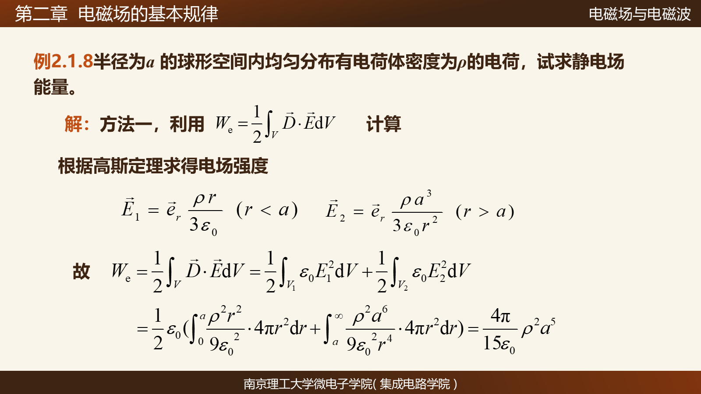

> 图 2-5　例 2.1.8 用 $\vec E\cdot\vec D/2$ 计算均匀带电球的能量，球内与球外都要积分。来源：《第二章 静电场》PPT 第 50 页。
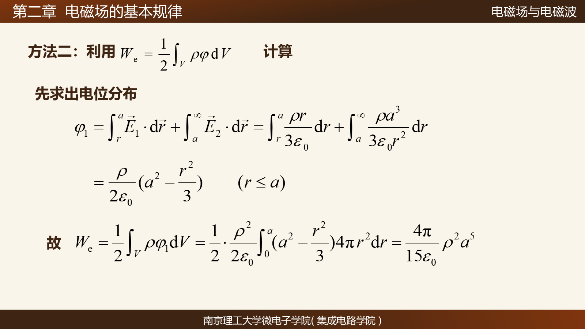

> 图 2-6　例 2.1.8 用 $\rho\varphi/2$ 计算能量，只在有体电荷的球内积分。来源：《第二章 静电场》PPT 第 51 页。
两种积分区域不要混淆：

- $\frac12\iiint\rho\varphi dV$ 只在有电荷的区域有贡献；
- $\frac12\iiint\vec E\cdot\vec D dV$ 要覆盖电场存在的整个空间。

因此，均匀带电球虽然电荷只分布在 $r<a$ ，球外 $r>a$ 仍有电场，也仍储存能量。例 2.1.8 的两种完整解法见[题型库](electrostatics-examples-2.1.3-2.1.7.md)。

---

## 2. 2.2 基本规律

### 2.1 2.2.1 静电场的散度与旋度

#### 散度与高斯定理

真空中静电场的微分形式为

$$
\boxed{\nabla\cdot\vec E=\frac{\rho}{\varepsilon_0}}.
$$

用散度定理积分化，得到高斯定理：

$$
\boxed{
\oint_S\vec E\cdot d\vec S
=\frac{1}{\varepsilon_0}\iiint_V\rho dV
=\frac{Q_{\mathrm{enc}}}{\varepsilon_0}
}.
$$

$S$ 必须是闭合曲面， $d\vec S=\vec n dS$ 取外法向。高斯定理永远成立，但只有球、轴、平面等高对称性足以把 $E$ 从面积分中提出时，它才是直接求场的捷径。

#### 旋度、斯托克斯定理与环路定理

静电场满足

$$
\boxed{\nabla\times\vec E=\vec 0}.
$$

由斯托克斯定理得到

$$
\boxed{
\oint_C\vec E\cdot d\vec l
=\iint_S(\nabla\times\vec E)\cdot d\vec S
=0
}.
$$

因此静电场是无旋场、保守场，电场力做功与路径无关。这里强调的是**静电场** ；随时间变化的磁场产生的电场一般不满足这一零环流关系。

#### 考试高频：微分形式与积分形式互换

| 物理规律 | 微分形式 | 数学工具 | 积分形式 |
|---|---|---|---|
| 有源性 | $\nabla\cdot\vec E=\rho/\varepsilon_0$ | 散度定理 | $\oint_S\vec E\cdot d\vec S=Q_{\mathrm{enc}}/\varepsilon_0$ |
| 无旋性 | $\nabla\times\vec E=\vec0$ | 斯托克斯定理 | $\oint_C\vec E\cdot d\vec l=0$ |

记忆线索：散度对应“闭合面通量”，旋度对应“闭合曲线环量”。

### 2.2 2.2.2 电荷守恒定律

电荷既不能被创造，也不能被消灭，只能转移。电流密度 $\vec J$ 的单位为 $\mathrm{A/m^2}$ ，它描述电荷怎样穿过面积流动。

积分形式为

$$
\boxed{
\oint_S\vec J\cdot d\vec S
=-\frac{d}{dt}\iiint_V\rho dV
}.
$$

负号表示：闭合面净流出的电流为正时，体积内的电荷量在减少。用散度定理得到微分形式：

$$
\boxed{
\nabla\cdot\vec J
+\frac{\partial\rho}{\partial t}=0
}.
$$

恒定电流中 $\partial\rho/\partial t=0$ ，因此

$$
\boxed{\nabla\cdot\vec J=0}.
$$

#### $\vec J$ 与 $\rho$ 、 $\rho_s$ 为什么不同

| 物理量 | 含义 | 单位 | 是否有方向 |
|---|---|---|---|
| $\rho$ | 单位体积存有多少电荷 | $\mathrm{C/m^3}$ | 否 |
| $\rho_s$ | 单位面积存有多少电荷 | $\mathrm{C/m^2}$ | 否 |
| $\vec J$ | 单位面积每秒通过多少电荷，并指出流动方向 | $\mathrm{A/m^2}$ | 是 |

> **理解提示：** $\rho$ 、 $\rho_s$ 是“存量”， $\vec J$ 是“流量密度”。它们的单位和物理意义都不同，不能因为都含“密度”就互相替换。

### 2.3 2.2.3 库仑定律与叠加原理

设源电荷 $q_2$ 位于 $\vec r_2$ ，受力电荷 $q_1$ 位于 $\vec r_1$ ，则

$$
\vec R_{12}=\vec r_1-\vec r_2,
\qquad
R_{12}=|\vec R_{12}|.
$$

真空中的库仑力为

$$
\boxed{
\vec F_{12}
=\frac{q_1q_2}{4\pi\varepsilon_0}
\frac{\vec R_{12}}{R_{12}^3}
},
\qquad
\vec F_{21}=-\vec F_{12}.
$$

多个源电荷共同作用时，

$$
\boxed{\vec F=\sum_i\vec F_i},
\qquad
\boxed{\vec E=\sum_i\vec E_i}.
$$

叠加的是矢量，必须统一坐标系、先分量后相加。源点、场点、距离矢量和连续分布积分的详细说明见[基础学习笔记](electrostatics-study-notes.md)。

### 2.4 2.2.4 电介质的本构关系

介质中的真实电场由自由电荷和极化电荷共同产生，因此

$$
\nabla\cdot\vec E
=\frac{\rho+\rho_p}{\varepsilon_0}.
$$

代入 $\rho_p=-\nabla\cdot\vec P$ ：

$$
\varepsilon_0\nabla\cdot\vec E
=\rho-\nabla\cdot\vec P.
$$

把极化项移到左侧，定义电位移矢量

$$
\boxed{\vec D=\varepsilon_0\vec E+\vec P}.
$$

于是

$$
\boxed{\nabla\cdot\vec D=\rho},
\qquad
\boxed{
\oint_S\vec D\cdot d\vec S=q_{\mathrm{free}}
}.
$$

这里的 $\rho$ 和 $q_{\mathrm{free}}$ 只指**自由电荷** 。

#### 为什么说 $\vec D$ 只追踪自由电荷

$\vec D$ 并不是忽略极化电荷，也不是说极化电荷不产生电场。定义 $\vec D=\varepsilon_0\vec E+\vec P$ 后，极化电荷通过 $\vec P$ 已经被吸收到左边的场量中，所以 $\nabla\cdot\vec D$ 的右边只剩自由电荷。材料怎样极化仍通过 $\vec P$ 与本构关系影响 $\vec D$ 和 $\vec E$ 的对应关系。

在线性、各向同性介质中，

$$
\vec P=\varepsilon_0\chi_e\vec E,
$$

所以

$$
\boxed{
\vec D
=\varepsilon_0(1+\chi_e)\vec E
=\varepsilon_0\varepsilon_r\vec E
=\varepsilon\vec E
}.
$$

其中 $\varepsilon_r=1+\chi_e$ ， $\varepsilon=\varepsilon_0\varepsilon_r$ 。若介质非线性或各向异性，不能简单把 $\varepsilon$ 当作一个常数标量。

---

## 3. 2.3 静电场的基本方程和边界条件

### 3.1 2.3.1 静电场的基本方程

在线性、各向同性介质中，静电场的方程组为

$$
\boxed{\nabla\cdot\vec D=\rho},
\qquad
\boxed{\nabla\times\vec E=\vec0},
\qquad
\boxed{\vec D=\varepsilon\vec E}.
$$

对应的积分形式为

$$
\boxed{
\oint_S\vec D\cdot d\vec S
=\iiint_V\rho dV
},
$$

$$
\boxed{
\oint_C\vec E\cdot d\vec l=0
}.
$$

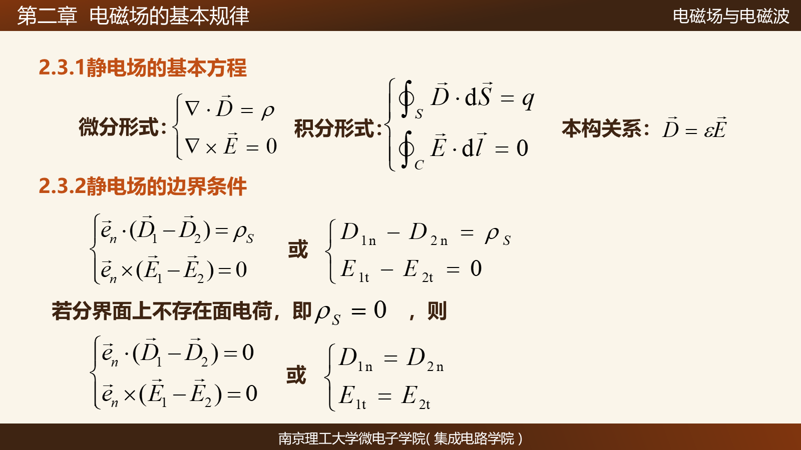

> 图 2-7　静电场基本方程、积分形式、本构关系和介质界面边界条件。来源：《第二章 静电场》PPT 第 59 页。课件中的分区编号与法向取向以原图为准；本文统一取 $\vec n$ 从介质 1 指向介质 2。
#### 考试常考：微分形式与积分形式怎么互换

- $\nabla\cdot\vec D=\rho$ 对体积积分，再用散度定理，得到闭合面通量式。
- $\nabla\times\vec E=\vec0$ 对开曲面积分，再用斯托克斯定理，得到边界闭合曲线上的环路式。
- 写完积分式后还要检查： $S$ 是否闭合， $C$ 是否为 $S$ 的边界， $d\vec S$ 与 $d\vec l$ 是否满足右手定则。

#### 教材例 2.3.1：球坐标散度的具体代入

教材给定球内径向电场

$$
\vec E=\vec e_r(r^3+Ar^2),
\qquad 0\le r\le a.
$$

在真空中 $\vec D=\varepsilon_0\vec E$ 。因为只有径向分量，且与 $\theta$ 、 $\phi$ 无关，球坐标散度公式退化为

$$
\nabla\cdot\vec D
=\frac1{r^2}\frac{d}{dr}(r^2D_r).
$$

所以

$$
\rho(r)
=\nabla\cdot\vec D
=\varepsilon_0\frac1{r^2}
\frac{d}{dr}\left[r^2(r^3+Ar^2)\right]
=\boxed{\varepsilon_0(5r^2+4Ar)}.
$$

完整的球内总电荷与球外场计算见[题型库](electrostatics-examples-2.1.3-2.1.7.md)。

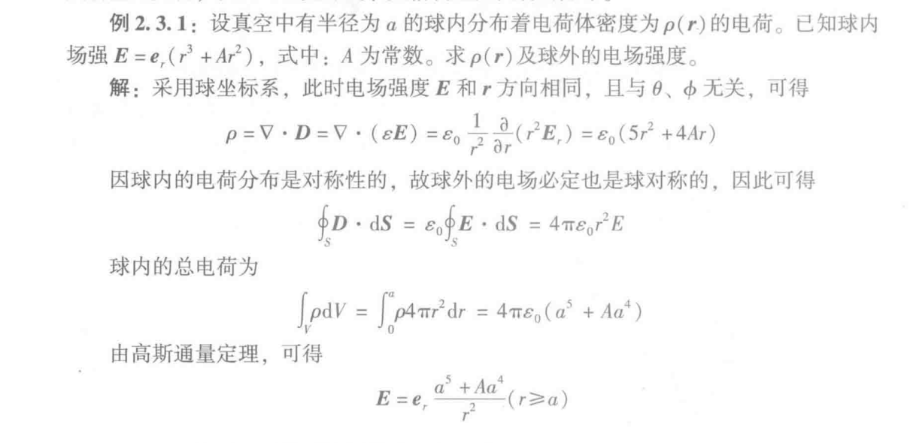

> 图 2-8　教材例 2.3.1：由球内径向场求 $\rho(r)$ ，再由总电荷求球外场。来源：教材 PDF 页序 62，印刷页 52 局部裁图。
### 3.2 2.3.2 静电场的边界条件

以下统一规定界面单位法向 $\vec n$ 从介质 1 指向介质 2。

#### $\vec D$ 的法向边界条件

在界面上跨取一个高度趋于零的薄柱形高斯面，得到

$$
\boxed{
\vec n\cdot(\vec D_2-\vec D_1)=\rho_s
},
$$

即

$$
\boxed{D_{2n}-D_{1n}=\rho_s}.
$$

这里 $\rho_s$ 是界面上的**自由面电荷密度** 。

#### $\vec E$ 的切向边界条件

在界面两侧跨取一个高度趋于零的狭长矩形回路，利用静电场环路定理，得到

$$
\boxed{
\vec n\times(\vec E_2-\vec E_1)=\vec0
},
$$

即

$$
\boxed{E_{2t}=E_{1t}}.
$$

记忆为

$$
\boxed{\vec D\text{ 看法向，}\qquad \vec E\text{ 看切向}}.
$$

若界面无自由面电荷，即 $\rho_s=0$ ，则

$$
D_{2n}=D_{1n},
\qquad
E_{2t}=E_{1t}.
$$

这不代表 $E_{1n}=E_{2n}$ ；当 $\varepsilon_1\ne\varepsilon_2$ 时，法向电场一般不同。

#### 场矢量的折射关系

若 $\rho_s=0$ ，并把 $\theta_1$ 、 $\theta_2$ 定义为 $\vec E_1$ 、 $\vec E_2$ 与法线的夹角，则

$$
\boxed{
\frac{\tan\theta_1}{\tan\theta_2}
=\frac{\varepsilon_1}{\varepsilon_2}
}.
$$

#### 导体表面的边界条件

静电平衡时导体内部

$$
\vec E_{\mathrm{in}}=\vec0.
$$

切向电场连续，因此外侧切向分量也为零：

$$
\boxed{E_t=0}.
$$

所以导体外表面的电场只剩法向分量：

$$
\boxed{\vec E=E_n\vec n}.
$$

再由法向边界条件得到

$$
\boxed{D_n=\rho_s},
\qquad
\boxed{E_n=\frac{\rho_s}{\varepsilon}}.
$$

> **为什么导体表面外侧只剩法向电场：** 若外侧存在切向电场，导体内自由电荷会沿表面继续移动，系统就还没有达到静电平衡；数学上同样可由导体内 $E_t=0$ 与切向连续性推出外侧 $E_t=0$ 。

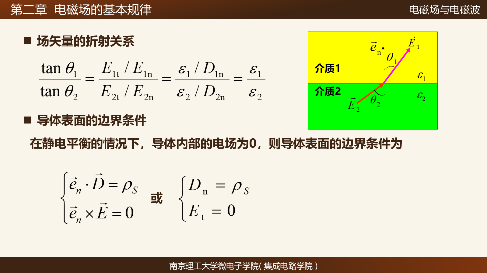

> 图 2-9　无自由面电荷时的场矢量折射关系，以及静电平衡导体表面的 $D_n=\rho_s$ 、 $E_t=0$ 。来源：《第二章 静电场》PPT 第 60 页。
### 3.3 2.3.3 电位函数及方程

#### 电位函数的定义

由于静电场无旋，可以用标量电位表示：

$$
\boxed{\vec E=-\nabla\varphi}.
$$

负号表示 $\vec E$ 指向电位下降最快的方向。点电荷的电位为

$$
\varphi(\vec r)
=\frac{1}{4\pi\varepsilon}
\frac{q}{|\vec r-\vec r'|}+C.
$$

由叠加原理，线、面、体电荷分别给出

$$
\varphi(\vec r)
=\frac{1}{4\pi\varepsilon}
\int_L\frac{\rho_l(\vec r')}{|\vec r-\vec r'|}dl'+C,
$$

$$
\varphi(\vec r)
=\frac{1}{4\pi\varepsilon}
\iint_S\frac{\rho_s(\vec r')}{|\vec r-\vec r'|}dS'+C,
$$

$$
\varphi(\vec r)
=\frac{1}{4\pi\varepsilon}
\iiint_V\frac{\rho(\vec r')}{|\vec r-\vec r'|}dV'+C.
$$

电位是标量，复杂分布中先叠加电位、再求梯度，往往比直接叠加矢量电场更简单。

#### 电位差与参考点

两点 $P$ 、 $Q$ 的电位差为

$$
\boxed{
\varphi(P)-\varphi(Q)
=\int_P^Q\vec E\cdot d\vec l
}.
$$

它只与首尾两点有关，与路径无关。电位本身可以相差一个常数，因此必须指定参考点。

- 电荷分布在有限区域内时，通常取 $\varphi(\infty)=0$ 。
- 无限长线电荷等无限源分布在无穷远处电位发散，不能机械取无穷远为零，应选有限参考点。
- 同一问题中参考点必须保持一致。

#### 泊松方程与拉普拉斯方程

在均匀、线性、各向同性介质中， $\varepsilon$ 为常数。将

$$
\vec D=\varepsilon\vec E,
\qquad
\vec E=-\nabla\varphi
$$

代入 $\nabla\cdot\vec D=\rho$ ，得到泊松方程：

$$
\boxed{
\nabla^2\varphi=-\frac{\rho}{\varepsilon}
}.
$$

无自由电荷区域 $\rho=0$ 时，退化为拉普拉斯方程：

$$
\boxed{\nabla^2\varphi=0}.
$$

> **适用条件：** 只有在 $\varepsilon$ 为空间常数时才可直接写成上述标量形式。非均匀介质应保留 $\nabla\cdot(\varepsilon\nabla\varphi)=-\rho$ 。

#### 电位的边界条件

界面两侧紧贴界面的点距离趋于零，而电场保持有限，因此电位差趋于零：

$$
\boxed{\varphi_1=\varphi_2}.
$$

由 $D_n=-\varepsilon\,\partial\varphi/\partial n$ 和 $D_{2n}-D_{1n}=\rho_s$ 得到

$$
\boxed{
\varepsilon_1\frac{\partial\varphi_1}{\partial n}
-\varepsilon_2\frac{\partial\varphi_2}{\partial n}
=\rho_s
}.
$$

若界面无自由面电荷，则

$$
\varepsilon_1\frac{\partial\varphi_1}{\partial n}
=\varepsilon_2\frac{\partial\varphi_2}{\partial n}.
$$

在导体表面， $\vec n$ 取从导体指向外部介质的外法向，边界条件为

$$
\boxed{\varphi=\text{常数}},
\qquad
\boxed{
\varepsilon\frac{\partial\varphi}{\partial n}=-\rho_s
}.
$$

第二式的来源是

$$
D_n=\rho_s
\Longrightarrow
\varepsilon E_n=\rho_s
\Longrightarrow
\varepsilon\left(-\frac{\partial\varphi}{\partial n}\right)=\rho_s.
$$

负号只来自 $\vec E=-\nabla\varphi$ 。

#### 为什么 $\varphi$ 连续，但导数可以突变

理想面电荷使法向电场发生有限跳变，而 $E_n=-\partial\varphi/\partial n$ ，所以 $\varphi$ 的法向导数可以突变。跨过厚度 $\Delta l\to0$ 的界面时，电位变化约为 $E\Delta l\to0$ ，因此电位本身仍连续。

可以把 $\varphi(x)$ 想成一条没有断开的折线：函数值接得上，但左右斜率不同。面电荷改变的是斜率，不是把电位撕开一个有限跳跃。

### 3.4 PPT 例 2.3.3：两接地平板与中间面电荷

两块无限大接地导体板位于 $x=0$ 、 $x=a$ ，中间 $x=b$ 处有自由面电荷密度 $\rho_{s0}$ 。除 $x=b$ 这一面外，其余区域均有 $\rho=0$ ，所以两侧分别满足一维拉普拉斯方程。

完整的分区、四个边界条件、常数求解、电位与电场结果见[题型库](electrostatics-examples-2.1.3-2.1.7.md)。该题在教材中编为同类例 2.3.5，PPT 编为例 2.3.3；本文按课堂 PPT 编号称呼。

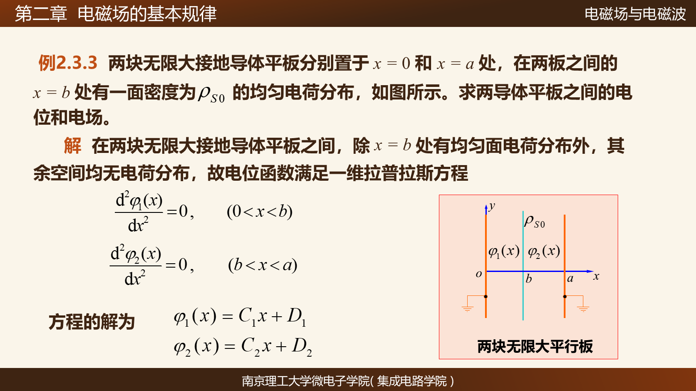

> 图 2-10　PPT 例 2.3.3 的题目、分区和一维拉普拉斯方程。来源：《第二章 静电场》PPT 第 70 页。
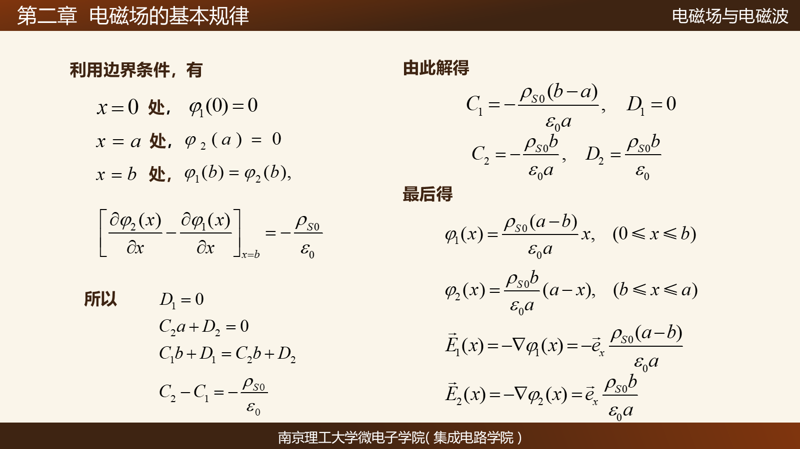

> 图 2-11　PPT 例 2.3.3 的四个边界条件及电位、电场结果。来源：《第二章 静电场》PPT 第 71 页。
---

## 4. 公式选择与考试重点

| 看到什么 | 优先想到什么 | 先检查的条件 |
|---|---|---|
| 高对称电荷分布，求场 | 高斯定理 | 球、轴、平面对称是否足以提出 $E$ |
| 一般连续电荷，求场 | 库仑积分或先求电位 | $\vec R=\vec r-\vec r'$ 是否写对 |
| 介质极化 | $\rho_p=-\nabla\cdot\vec P$ 、 $\rho_{ps}=\vec P\cdot\vec n$ | 外法向和自由/束缚电荷 |
| 只想追踪自由电荷 | $\nabla\cdot\vec D=\rho$ | 本构关系是否可写成 $\vec D=\varepsilon\vec E$ |
| 给导体结构求电容 | $q\to\vec E\to U\to C$ 或反向路线 | 端口、接地、近似条件 |
| 求静电能 | $\rho\varphi/2$ 或 $\vec E\cdot\vec D/2$ | 积分区域是有电荷区还是整个有场区 |
| 介质界面 | $D_{2n}-D_{1n}=\rho_s$ 、 $E_{2t}=E_{1t}$ | 法向约定、是否有自由面电荷 |
| 导体表面 | $E_t=0$ 、 $D_n=\rho_s$ | 是否处于静电平衡 |
| 给电位或电位边界 | $\vec E=-\nabla\varphi$ | 参考点、坐标系和边界条件 |
| 有体电荷区 | 泊松方程 | $\varepsilon$ 是否均匀 |
| 无自由电荷区 | 拉普拉斯方程 | 分区是否正确 |

### 考前必须会写的“微分 ↔ 积分”三组

$$
\nabla\cdot\vec D=\rho
\quad\Longleftrightarrow\quad
\oint_S\vec D\cdot d\vec S=\iiint_V\rho dV,
$$

$$
\nabla\times\vec E=\vec0
\quad\Longleftrightarrow\quad
\oint_C\vec E\cdot d\vec l=0,
$$

$$
\nabla\cdot\vec J+\frac{\partial\rho}{\partial t}=0
\quad\Longleftrightarrow\quad
\oint_S\vec J\cdot d\vec S
=-\frac{d}{dt}\iiint_V\rho dV.
$$

---

## 5. 高频易错点与理解提示

1. **真实球半径 $a$ 与场点半径 $r$ ：** $a$ 是固定几何尺寸， $r$ 是变量； $r<a$ 时高斯面只包围半径 $r$ 内的部分电荷， $r>a$ 时才包围整个球。
2. **球外为什么也要算能量：** 场能量密度存在于有电场的空间；球外虽无体电荷，但 $\vec E\ne\vec0$ 。
3. **电流密度与电荷密度：** $\vec J$ 描述流动， $\rho$ 、 $\rho_s$ 描述存量，单位也不同。
4. **为什么 $\vec D$ 只追踪自由电荷：** 极化电荷没有消失，而是通过 $\vec P$ 被吸收到 $\vec D$ 的定义和本构关系中。
5. **边界条件的法向符号：** 先写清 $\vec n$ 从哪一侧指向哪一侧，再写 $D_{2n}-D_{1n}=\rho_s$ ；换法向，式子整体符号也随之改变。
6. **导体表面只有法向场：** 导体内 $\vec E=\vec0$ ，切向连续迫使外侧 $E_t=0$ 。
7. **电位法向边界条件的负号：** $\varepsilon\partial\varphi/\partial n=-\rho_s$ 的负号只来自 $\vec E=-\nabla\varphi$ 。
8. **电位连续不等于导数连续：** 理想面电荷使法向电场和 $\partial\varphi/\partial n$ 跳变，但有限场跨越零厚度不会造成有限电位跳跃。
9. **泊松/拉普拉斯先分区：** 面电荷只在一张面上，并不代表相邻两个体区域都有 $\rho\ne0$ ；区域内无体电荷时仍解拉普拉斯方程，再用界面跳变条件连接。
10. **球坐标散度不要漏尺度因子：** 纯径向球对称场用 $r^{-2}d(r^2D_r)/dr$ ，不是简单的 $dD_r/dr$ 。

## 6. 资料与图片说明

- 教材：《电磁场与电磁波》第二章，印刷页 29–59，对应本地 PDF 页序 39–69。
- 课件：《第二章 静电场》PPT，第 4–71 页。
- 课堂对话：连续电荷求场、均匀带电球的内外分段与能量、 $\vec D$ 的引入、 $\vec J$ 与电荷密度的区别、导体表面条件、电位导数跳变，以及两接地平板例题。
- 仓库只保留必要的课件页面或教材局部裁图；未收入完整教材、完整课件，也未使用聊天截图代替来源。
