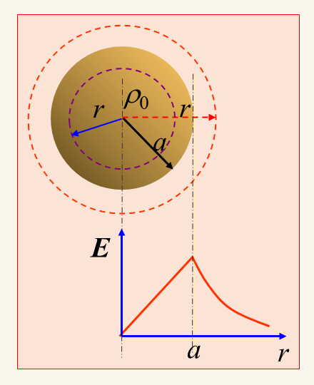

# 第二章题型库：静电场完整题型与解题方法

本页按“识别信号 → 建模 → 计算 → 自检”整理本阶段典型题。公式的适用条件与物理解释见[概念与课堂笔记](electrostatics-concepts-2.1.3-2.1.7.md)。

## 使用方法

看到题目后先问四件事：

1. 源分布具有球、轴还是平面对称性吗？
2. 题目给的是电荷、场、电位，还是导体边界条件？
3. 积分区域应覆盖有电荷处，还是覆盖有电场处？
4. 使用的公式是否要求真空、线性介质、远区或 $D\gg a$ 等条件？

---

## 题型 1：用高斯定理求对称电荷分布的电场

### 识别信号

题目出现均匀带电球、同心球壳、无限长线电荷、无限长圆柱面或无限大带电平面。

### 通用模板

1. 根据源分布判断 $\vec E$ 的方向。
2. 选取与源分布具有相同对称性的闭合高斯面。
3. 写出

$$
\oint_S\vec E\cdot d\vec S
=\frac{Q_{\mathrm{enc}}}{\varepsilon_0}.
$$

4. 分区域计算 $Q_{\mathrm{enc}}$ 。
5. 求出 $E$ 后补上方向，并检查边界值、量纲和远区极限。

### 例：均匀带电实心球

半径为 $a$ 的球内均匀分布体电荷密度 $\rho$ 。以球心为中心、半径为 $r$ 取球形高斯面。球面上

$$
\vec E=E(r)\vec e_r,
\qquad
\oint_S\vec E\cdot d\vec S=E(r)4\pi r^2.
$$

$r<a$ 时，高斯面只包围半径 $r$ 内的部分电荷：

$$
Q_{\mathrm{enc}}=\rho\frac{4}{3}\pi r^3,
$$

所以

$$
\vec E_{\mathrm{in}}
=\vec e_r\frac{\rho r}{3\varepsilon_0}.
$$

$r>a$ 时，高斯面包围整个真实带电球：

$$
Q_{\mathrm{enc}}=\rho\frac{4}{3}\pi a^3,
$$

所以

$$
\vec E_{\mathrm{out}}
=\vec e_r\frac{\rho a^3}{3\varepsilon_0r^2}.
$$



> 图 2-5　 $a$ 是真实带电球的固定半径， $r$ 是高斯面的半径，也是场点到球心的距离。来源：《第二章 静电场》PPT，第 20 页局部裁图。

### 三个自检

1. 球心处 $E(0)=0$ ，符合对称性。
2. 在 $r=a$ 处，内外两式都给出 $E=\rho a/(3\varepsilon_0)$ ，电场连续。
3. 球外场可写成 $E=Q/(4\pi\varepsilon_0r^2)$ ，与同总电荷的点电荷场一致。

### 最容易错的地方

球外仍把包围电荷写成 $\rho(4\pi r^3/3)$ 。这相当于假设 $a<r$ 的空白区域也有电荷；正确上限只能到真实带电边界 $a$ 。

---

## 题型 2：由电位求电偶极子的远区场

### 识别信号

题目给出 $+q$ 、 $-q$ ，间距 $l$ 很小，并且场点满足 $r\gg l$ 。

### 方法

先写电偶极矩

$$
\vec p=q\vec l,
$$

再使用远区电位

$$
\varphi
=\frac{\vec p\cdot\vec e_r}{4\pi\varepsilon_0r^2}.
$$

最后用

$$
\vec E=-\nabla\varphi.
$$

若 $\vec p$ 沿 $z$ 轴，在球坐标中

$$
\vec E
=-\vec e_r\frac{\partial\varphi}{\partial r}
-\vec e_\theta\frac{1}{r}\frac{\partial\varphi}{\partial\theta},
$$

得到

$$
\vec E
=\frac{p}{4\pi\varepsilon_0r^3}
\left(2\cos\theta \vec e_r+\sin\theta \vec e_\theta\right).
$$

### 两个特殊方向

偶极轴上 $\theta=0$ ：

$$
\vec E_{\mathrm{axis}}
=\vec e_r\frac{2p}{4\pi\varepsilon_0r^3}.
$$

赤道面上 $\theta=\pi/2$ ：

$$
\vec E_{\mathrm{equator}}
=\vec e_\theta\frac{p}{4\pi\varepsilon_0r^3}.
$$

在赤道面上 $\vec e_\theta$ 指向与 $\vec p$ 相反的一侧，所以不要只看分量前的正号判断空间方向。

---

## 题型 3：由 $\vec P$ 求极化体电荷和面电荷

### 识别信号

题目给出介质区域和 $\vec P(\vec r)$ ，要求束缚电荷分布。

### 计算模板

介质内部：

$$
\rho_p=-\nabla\cdot\vec P.
$$

介质表面：

$$
\rho_{ps}=\vec P\cdot\vec n,
$$

其中 $\vec n$ 必须是介质的外法向。

### 例 1：均匀极化平板

设平板内 $\vec P=P_0\vec e_z$ 为常矢量，则

$$
\rho_p=-\nabla\cdot\vec P=0.
$$

上表面 $\vec n=\vec e_z$ ：

$$
\rho_{ps}=P_0.
$$

下表面 $\vec n=-\vec e_z$ ：

$$
\rho_{ps}=-P_0.
$$

这说明“体内没有极化电荷”并不等于“没有极化电荷”；束缚电荷集中在两个表面。

### 例 2：球内径向非均匀极化

设半径 $a$ 的球内

$$
\vec P=kr\vec e_r.
$$

球坐标中纯径向场的散度为

$$
\nabla\cdot\vec P
=\frac{1}{r^2}\frac{d}{dr}(r^2P_r)
=\frac{1}{r^2}\frac{d}{dr}(kr^3)
=3k.
$$

因此

$$
\rho_p=-3k,
$$

球面 $r=a$ 上

$$
\rho_{ps}=ka.
$$

总束缚体电荷与总束缚面电荷分别为

$$
Q_{p,V}=(-3k)\frac{4}{3}\pi a^3=-4\pi ka^3,
$$

$$
Q_{p,S}=(ka)4\pi a^2=4\pi ka^3.
$$

二者相加为零，符合每个偶极子总电荷为零的事实。

---

## 题型 4：双导体电容的一般求法

### 路线选择

| 已知条件 | 推荐路线 |
|---|---|
| 电荷分布容易假设，场具有强对称性 | $q\rightarrow\vec E\rightarrow U\rightarrow C$ |
| 导体边界电位已知，适合解电位方程 | $U\rightarrow\varphi\rightarrow\vec E\rightarrow\rho_s\rightarrow q\rightarrow C$ |

不论走哪条路线，最终都使用

$$
C=\frac{q}{U}.
$$

### 路线一的符号处理

令高、低电位导体的电位分别为 $\varphi_H$ 、 $\varphi_L$ ，且 $\varphi_H>\varphi_L$ 。若把 $U$ 定义为高电位导体相对低电位导体的电压，应沿电场方向从 $H$ 积分到 $L$ ：

$$
U=\varphi_H-\varphi_L
=\int_H^L\vec E\cdot d\vec l>0.
$$

若使用 $\varphi_1-\varphi_2=-\int_2^1\vec E\cdot d\vec l$ ，则要同时检查积分起止点与负号，不能把两个约定混用。

---

## 题型 5：平行双线单位长度电容

### 题目模型

两根平行导线半径为 $a$ ，轴线距离为 $D$ ，满足 $D\gg a$ 。每单位长度分别带 $+\rho_l$ 和 $-\rho_l$ ，介质介电常数为 $\varepsilon$ 。

### 第一步：为什么能用无限长线电荷场

$D\gg a$ 时，导线表面电荷分布可近似看成围绕各自轴线均匀。两导线之间、距正导线轴线为 $x$ 的点处，两根线电荷产生的场方向相同：

$$
\vec E(x)
=\vec e_x\frac{\rho_l}{2\pi\varepsilon}
\left(\frac1x+\frac1{D-x}\right).
$$

这个线电荷场可由半径为 $x$ 、长度为 $L$ 的同轴圆柱高斯面得到：

$$
E(2\pi xL)=\frac{\rho_lL}{\varepsilon},
$$

所以

$$
E=\frac{\rho_l}{2\pi\varepsilon x}.
$$

### 第二步：积分求电压

从正导线表面 $x=a$ 积分到负导线表面 $x=D-a$ ：

$$
U
=\int_a^{D-a}\vec E\cdot d\vec l
=\frac{\rho_l}{2\pi\varepsilon}
\int_a^{D-a}
\left(\frac1x+\frac1{D-x}\right)dx.
$$

得到

$$
U=\frac{\rho_l}{\pi\varepsilon}
\ln\frac{D-a}{a}.
$$

### 第三步：单位长度电容

$$
C'=\frac{\rho_l}{U}
=\frac{\pi\varepsilon}{\ln[(D-a)/a]}
\approx\frac{\pi\varepsilon}{\ln(D/a)}.
$$

### 易错点

- 电荷量应使用单位长度电荷 $\rho_l$ ，答案单位是 $\mathrm{F/m}$ 。
- 两导线之间两个电场同向，因此是相加，不是相减。
- 积分上下限是两个导线表面 $a$ 与 $D-a$ ，不是两个轴线 $0$ 与 $D$ 。
- 最后一步近似仍依赖 $D\gg a$ 。

---

## 题型 6：多导体系统中的系数与等效电容

### 三层表示

1. 电位系数： $[\varphi]=[\alpha][q]$ 。
2. 电容系数： $[q]=[\beta][\varphi]$ ，且 $[\beta]=[\alpha]^{-1}$ 。
3. 部分电容：把多导体耦合改画成导体之间及导体到参考地之间的电容网络。

### 解题顺序

1. 先明确哪两个节点是测量端口。
2. 标出哪些导体接地、悬空或保持给定电位。
3. 用部分电容网络做普通串并联化简，或直接由电容系数矩阵列 $q_i$ 与 $\varphi_i$ 的关系。
4. 只在端口上使用 $C_{\mathrm{eq}}=q/U$ 。

### 典型结构

若两个导体各自通过 $C_{11}$ 、 $C_{22}$ 接参考地，二者之间还有 $C_{12}$ ，从两个导体之间看进去：

$$
C_{\mathrm{eq}}
=C_{12}+\frac{C_{11}C_{22}}{C_{11}+C_{22}}.
$$

第一项是端口之间的直接电容；第二项是经参考地串联形成的支路。不能只取 $C_{12}$ 。

---

## 题型 7：电场能量公式怎么选

| 已知量或结构 | 优先公式 | 积分区域 |
|---|---|---|
| 单个线性电容器，已知 $q,U,C$ | $W_e=qU/2=CU^2/2=q^2/(2C)$ | 不需要空间积分 |
| 已知各导体的 $q_i,\varphi_i$ | $W_e=\sum_iq_i\varphi_i/2$ | 对导体求和 |
| 已知电荷密度与电位 | $W_e=\iiint\rho\varphi dV/2$ | 有电荷的区域 |
| 已知 $\vec E,\vec D$ | $W_e=\iiint\vec E\cdot\vec D dV/2$ | 电场存在的整个空间 |

### 为什么电容器能量有三种写法

由 $q=CU$ 代换：

$$
\frac12qU
=\frac12(CU)U
=\frac12CU^2,
$$

也可以用 $U=q/C$ ：

$$
\frac12qU
=\frac12q\frac qC
=\frac{q^2}{2C}.
$$

三个公式物理上完全等价；选择能避免额外求未知量的一个即可。

### $1/2$ 的来源

在线性充电过程中，电位从 0 随电荷线性增大到最终值 $U$ 。平均电位是 $U/2$ ，所以把总电荷 $q$ 送入系统所需能量为

$$
W_e=q\frac U2.
$$

若介质非线性，电位不再与电荷简单成正比，就不能直接凭这个平均值写出 $1/2$ 。

---

## 题型 8：例 2.1.8——均匀带电球体的静电场能量

### 题目

半径为 $a$ 的球形空间内均匀分布体电荷密度 $\rho$ ，球外为真空，求静电场能量。

### 先分清 $a$ 与 $r$

- $a$ ：真实带电球的固定半径，是电荷分布的边界。
- $r$ ：场点到球心的距离，也是所选球形高斯面的半径，会随考察位置变化。

因此 $r<a$ 与 $r>a$ 不是“两个不同的球”，而是同一个带电球内部与外部的两个场点区域。分区的根本原因是高斯面包围的电荷量不同。

### 第一步：用高斯定理求分段电场

球对称使得半径 $r$ 的球面上

$$
\oint_S\vec E\cdot d\vec S=E(r)4\pi r^2.
$$

| 区域 | 高斯面包围的电荷 | 电场 |
|---|---|---|
| $0\le r<a$ | $\rho(4\pi r^3/3)$ | $\vec E_1=\vec e_r\rho r/(3\varepsilon_0)$ |
| $r>a$ | $\rho(4\pi a^3/3)$ | $\vec E_2=\vec e_r\rho a^3/(3\varepsilon_0r^2)$ |

在 $r=a$ 时两式相等，所以电场连续。若题目把边界归入任意一侧，结果都相同。

### 方法一：场能量法

真空中 $\vec D=\varepsilon_0\vec E$ ，故

$$
W_e=\frac{\varepsilon_0}{2}\iiint E^2 dV.
$$

电荷虽然只存在于 $r<a$ ，但球外仍有电场，因此球外也储存能量。球对称薄壳体积元为

$$
dV=4\pi r^2dr.
$$

球内能量：

$$
W_{\mathrm{in}}
=\frac{\varepsilon_0}{2}
\int_0^a
\left(\frac{\rho r}{3\varepsilon_0}\right)^2
4\pi r^2dr
=\frac{2\pi\rho^2a^5}{45\varepsilon_0}.
$$

球外能量：

$$
W_{\mathrm{out}}
=\frac{\varepsilon_0}{2}
\int_a^{\infty}
\left(\frac{\rho a^3}{3\varepsilon_0r^2}\right)^2
4\pi r^2dr
=\frac{2\pi\rho^2a^5}{9\varepsilon_0}.
$$

相加得到

$$
\boxed{
W_e
=\frac{4\pi\rho^2a^5}{15\varepsilon_0}
}.
$$


> 图 2-6　球内、球外分别积分后相加。来源：《第二章 静电场》PPT 第 50 页。

而且

$$
W_{\mathrm{out}}=5W_{\mathrm{in}}.
$$

虽然全部电荷都在球内，大部分电场能量却储存在球外。这再次说明能量分布在有场的空间，而不是只分布在有电荷处。

### 方法二：电荷—电位法

先取无穷远为零电位。对球内场点 $r\le a$ ，从 $r$ 到无穷远会依次经过球内、球外两个区域，因此

$$
\varphi(r)
=\int_r^a\vec E_1\cdot d\vec l
+\int_a^{\infty}\vec E_2\cdot d\vec l.
$$

代入分段电场：

$$
\varphi(r)
=\int_r^a\frac{\rho r'}{3\varepsilon_0}dr'
+\int_a^{\infty}
\frac{\rho a^3}{3\varepsilon_0r'^2}dr'
=\frac{\rho}{2\varepsilon_0}
\left(a^2-\frac{r^2}{3}\right).
$$

因为 $\rho=0$ 于球外，电荷—电位法只需在球内积分：

$$
W_e
=\frac12\int_0^a\rho\varphi(r)4\pi r^2dr.
$$

所以

$$
W_e
=\frac12\int_0^a
\rho\frac{\rho}{2\varepsilon_0}
\left(a^2-\frac{r^2}{3}\right)
4\pi r^2dr
=\boxed{\frac{4\pi\rho^2a^5}{15\varepsilon_0}}.
$$


> 图 2-7　先求球内电位，再只在有电荷的球内积分。来源：《第二章 静电场》PPT 第 51 页。

### 用总电荷改写并做量纲检查

总电荷

$$
Q=\rho\frac43\pi a^3.
$$

代入后

$$
W_e=\frac{3Q^2}{20\pi\varepsilon_0a}.
$$

结构上是 $Q^2/(\varepsilon_0a)$ ，与电势能的量纲一致；球半径越小，在总电荷固定时能量越大。

### 两种方法的核心区别

| 方法 | 被积对象 | 为什么这样分区 |
|---|---|---|
| 场能量法 | $\vec E\cdot\vec D/2$ | 球内外都有场，必须积分 $0\to a$ 和 $a\to\infty$ |
| 电荷—电位法 | $\rho\varphi/2$ | 只有球内有电荷，只积分 $0\to a$ ；但求球内电位时仍要跨过两种场区间 |

### 本题最容易错的六点

1. 把高斯面半径 $r$ 当成真实球半径 $a$ 。
2. 球外仍使用 $Q_{\mathrm{enc}}\propto r^3$ 。
3. 场能量法只积分球内，漏掉球外能量。
4. 忘记球壳体积元 $dV=4\pi r^2dr$ 。
5. 求球内电位时只积 $r\to a$ ，漏掉 $a\to\infty$ 的球外段。
6. 在 $r=a$ 处不检查内外场是否连续。

---

## 题型 9：教材例 2.3.1——球坐标散度的具体计算

### 题目

真空中半径为 $a$ 的球内分布着体电荷。已知球内电场

$$
\vec E=\vec e_r(r^3+Ar^2),
\qquad 0\le r\le a,
$$

其中 $A$ 为常数。求球内 $\rho(r)$ 和球外电场。

### 第一步：判断球坐标公式能简化到哪一步

一般球坐标散度为

$$
\nabla\cdot\vec D
=\frac1{r^2}\frac{\partial(r^2D_r)}{\partial r}
+\frac1{r\sin\theta}
\frac{\partial(D_\theta\sin\theta)}{\partial\theta}
+\frac1{r\sin\theta}
\frac{\partial D_\phi}{\partial\phi}.
$$

本题只有径向分量， $D_\theta=D_\phi=0$ ，且 $D_r$ 与 $\theta$ 、 $\phi$ 无关，所以后两项为零：

$$
\boxed{
\nabla\cdot\vec D
=\frac1{r^2}\frac{d(r^2D_r)}{dr}
}.
$$

真空中 $\vec D=\varepsilon_0\vec E$ ，因此

$$
D_r=\varepsilon_0(r^3+Ar^2).
$$

### 第二步：由 $\nabla\cdot\vec D=\rho$ 求体电荷密度

$$
\begin{aligned}
\rho(r)
&=\frac1{r^2}\frac{d}{dr}
\left[\varepsilon_0r^2(r^3+Ar^2)\right]\\
&=\frac{\varepsilon_0}{r^2}
\frac{d}{dr}(r^5+Ar^4)\\
&=\boxed{\varepsilon_0(5r^2+4Ar)}.
\end{aligned}
$$

> **课堂疑点对应：** 球坐标散度不是简单的 $dD_r/dr$ ； $r^2D_r$ 里的 $r^2$ 来自球面面积随半径变化。

### 第三步：求球内总电荷

球对称体积元为 $dV=4\pi r^2dr$ ，所以

$$
\begin{aligned}
q
&=\int_0^a\rho(r)4\pi r^2dr\\
&=4\pi\varepsilon_0
\int_0^a(5r^4+4Ar^3)dr\\
&=\boxed{4\pi\varepsilon_0(a^5+Aa^4)}.
\end{aligned}
$$

### 第四步：由高斯定理求球外场

球外没有新的电荷，半径 $r\ge a$ 的球形高斯面包围的电荷恒为上式的 $q$ ：

$$
\varepsilon_0E_{\mathrm{out}}4\pi r^2=q.
$$

因此

$$
\boxed{
\vec E_{\mathrm{out}}
=\vec e_r\frac{a^5+Aa^4}{r^2},
\qquad r\ge a
}.
$$

在 $r=a$ 处，球内式与球外式都给出 $\vec e_r(a^3+Aa^2)$ ，场连续。


> 图 2-8　教材例 2.3.1 的题目、散度代入、总电荷和球外场。来源：教材 PDF 页序 62，印刷页 52 局部裁图。

### 本题最容易错的四点

1. 把球坐标散度错写成 $dD_r/dr$ 。
2. 漏掉真空本构关系 $\vec D=\varepsilon_0\vec E$ 。
3. 积分总电荷时漏掉球壳体积元 $4\pi r^2dr$ 。
4. 球外仍把 $Q_{\mathrm{enc}}$ 写成随 $r$ 增长；真实带电区只到 $a$ ，球外包围电荷已经固定。

---

## 题型 10：PPT 例 2.3.3——两接地平板与中间面电荷

> 教材中的同类题编为例 2.3.5；课堂 PPT 编为例 2.3.3。本文按课堂编号称呼。

### 题目与分区

两块无限大接地导体平板位于

$$
x=0,
\qquad
x=a.
$$

在 $x=b$ 处有自由面电荷密度 $\rho_{s0}$ 。两板接地给出

$$
\varphi(0)=0,
\qquad
\varphi(a)=0.
$$

无限大平面结构沿 $y$ 、 $z$ 方向没有变化，因此 $\varphi=\varphi(x)$ 。面电荷只位于 $x=b$ 这一张面上；区域 $0<x<b$ 和 $b<x<a$ 内都没有体电荷，所以分别满足一维拉普拉斯方程：

$$
\frac{d^2\varphi_1}{dx^2}=0,
\qquad 0<x<b,
$$

$$
\frac{d^2\varphi_2}{dx^2}=0,
\qquad b<x<a.
$$


> 图 2-9　两接地平板、面电荷位置与分区。来源：《第二章 静电场》PPT 第 70 页。

### 第一步：写两个区域的通解

$$
\varphi_1(x)=C_1x+D_1,
$$

$$
\varphi_2(x)=C_2x+D_2.
$$

共有四个未知常数，因此需要四个独立边界条件。

### 第二步：写出四个边界条件

左板接地：

$$
\varphi_1(0)=0.
$$

右板接地：

$$
\varphi_2(a)=0.
$$

在 $x=b$ 处电位连续：

$$
\varphi_1(b)=\varphi_2(b).
$$

在 $x=b$ 处，取法向为 $+\vec e_x$ 。由

$$
D_{2x}-D_{1x}=\rho_{s0},
\qquad
D_x=\varepsilon_0E_x
=-\varepsilon_0\frac{d\varphi}{dx},
$$

得到导数跳变条件

$$
\boxed{
\left[
\frac{d\varphi_2}{dx}
-\frac{d\varphi_1}{dx}
\right]_{x=b}
=-\frac{\rho_{s0}}{\varepsilon_0}
}.
$$

> **为什么电位连续、导数却跳变：** $\varphi$ 跨越零厚度界面的变化趋于零，所以函数值连续；面电荷使法向电场跳变，而 $E_x=-d\varphi/dx$ ，因此斜率可以突变。

### 第三步：把条件代入四个常数

由四个条件得到

$$
D_1=0,
$$

$$
C_2a+D_2=0,
$$

$$
C_1b+D_1=C_2b+D_2,
$$

$$
C_2-C_1=-\frac{\rho_{s0}}{\varepsilon_0}.
$$

解得

$$
C_1=\frac{\rho_{s0}(a-b)}{\varepsilon_0a},
\qquad
D_1=0,
$$

$$
C_2=-\frac{\rho_{s0}b}{\varepsilon_0a},
\qquad
D_2=\frac{\rho_{s0}b}{\varepsilon_0}.
$$

### 第四步：写出电位

区域 1：

$$
\boxed{
\varphi_1(x)
=\frac{\rho_{s0}(a-b)}{\varepsilon_0a}x,
\qquad 0\le x\le b
}.
$$

区域 2：

$$
\boxed{
\varphi_2(x)
=\frac{\rho_{s0}b}{\varepsilon_0a}(a-x),
\qquad b\le x\le a
}.
$$

在 $x=b$ 处，两式都给出

$$
\varphi(b)
=\frac{\rho_{s0}b(a-b)}{\varepsilon_0a},
$$

因此电位连续。

### 第五步：由 $\vec E=-\nabla\varphi$ 求电场

这里只随 $x$ 变化，所以

$$
\vec E=-\vec e_x\frac{d\varphi}{dx}.
$$

区域 1：

$$
\boxed{
\vec E_1
=-\vec e_x
\frac{\rho_{s0}(a-b)}{\varepsilon_0a}
}.
$$

区域 2：

$$
\boxed{
\vec E_2
=+\vec e_x
\frac{\rho_{s0}b}{\varepsilon_0a}
}.
$$

若 $\rho_{s0}>0$ ，左侧电场向 $-\vec e_x$ ，右侧电场向 $+\vec e_x$ ，正好从正面电荷向两侧发散。


> 图 2-10　四个边界条件、积分常数、电位和电场结果。来源：《第二章 静电场》PPT 第 71 页。

### 三个自检

1. $\varphi_1(0)=0$ 、 $\varphi_2(a)=0$ ，满足两板接地。
2. $\varphi_1(b)=\varphi_2(b)$ ，电位连续。
3. 电场跳变满足 $\varepsilon_0(E_{2x}-E_{1x})=\rho_{s0}$ 。

若 $b=a/2$ ，面电荷位于正中间，则

$$
|E_1|=|E_2|=\frac{\rho_{s0}}{2\varepsilon_0},
$$

与孤立无限大均匀面电荷两侧场强一致。

### 这类边值题的标准套路

$$
\boxed{
\text{按源分区}
\longrightarrow
\text{各区写泊松/拉普拉斯方程}
\longrightarrow
\text{写通解}
\longrightarrow
\text{列足够的边界条件}
\longrightarrow
\text{解常数}
\longrightarrow
\vec E=-\nabla\varphi
}.
$$

---

## 综合题决策流程

```text
先看已知量
├─ 给电荷分布
│  ├─ 有高对称性：优先高斯定理
│  └─ 无高对称性：库仑积分或先求电位
├─ 给电位或导体边界
│  ├─ 有体电荷：解泊松方程
│  ├─ 无体电荷：解拉普拉斯方程
│  └─ 用电位连续、法向导数跳变和导体电位确定常数
├─ 给极化强度
│  ├─ 体内：求极化强度的负散度
│  └─ 表面：求极化强度的外法向分量
├─ 给介质界面
│  ├─ 检查电位移矢量法向分量
│  └─ 检查电场强度切向分量
├─ 求电容
│  └─ 从电荷求电压，或从电位反求电荷
└─ 求能量
   ├─ 已知 q、U、C：用电容器公式
   ├─ 已知 ρ、φ：在有电荷区积分
   └─ 已知场分布：在整个有场空间积分
```

## 资料说明

本题型库依据教材《电磁场与电磁波》第二章（印刷页 29–59，对应本地 PDF 页序 39–69）、课件《第二章 静电场》PPT 第 17–71 页，以及学习对话中对例 2.1.8、教材例 2.3.1 和 PPT 例 2.3.3 的追问整理。例题条件不完整处未自行补题；所有教材和课件图片均注明来源页码。
