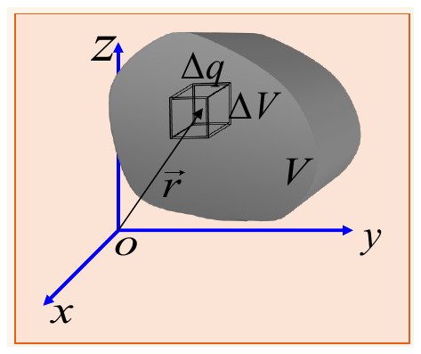
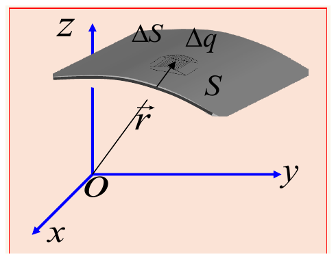
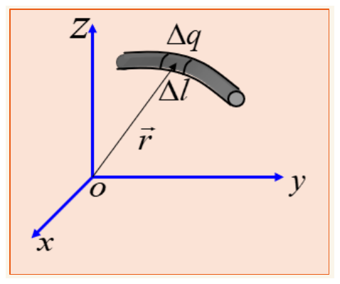
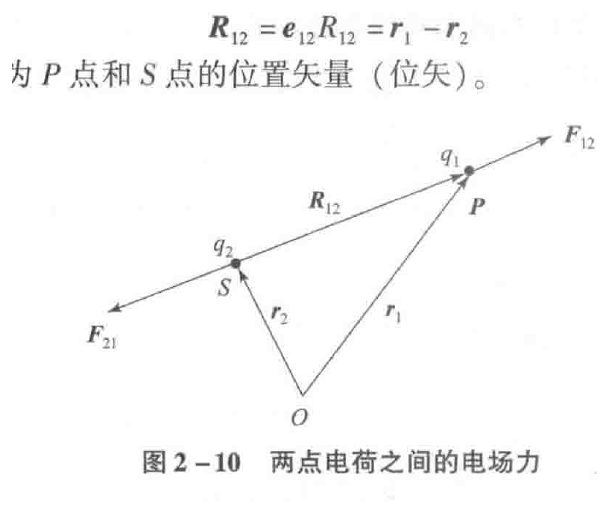
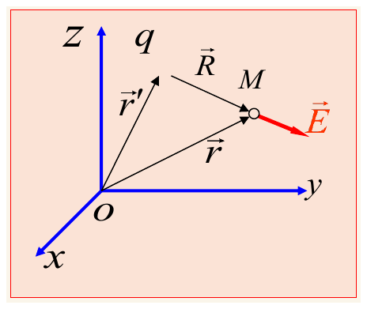
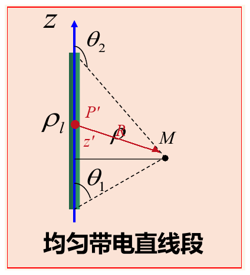
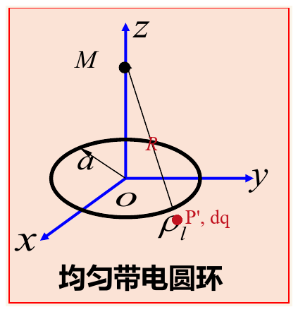

# 第二章学习笔记：静电场

> 资料主线：教材第 2 章 2.1.1、2.1.2、2.2.3（PDF 第 39–41、56–57 页，对应教材印刷页 29–31、46–47），课堂 PPT 第 4、6–15 页。本文按“物理意义 → 数学表达 → 怎么用 → 考试重点”组织，只覆盖本次课堂已经学习的内容。

## 0. 本次内容的主线

```text
电荷（源量）
  ↓ 库仑定律 + 叠加原理
电场强度 E（场量）
  ↓ 把连续电荷切成 dq 并积分
体、面、线电荷的电场
  ↓ 利用几何关系和对称性
有限直线段、无限长直线、圆环的电场
```

做题时始终追问四件事：**源在哪里？场算在哪里？从源指向场点的矢量是什么？对哪个变量积分？**

## 1. 源量与场量

### 物理意义

电磁场模型中的物理量可分为两类：

- **源量**描述“是谁产生场”：本章的源是电荷；以后研究磁场时，电流是重要的源。
- **场量**描述“源在空间中造成了什么”：电荷产生电场，电场强度用 $\mathbf E$ 表示；电流与磁场之间也有对应关系。

因此本章不是孤立地记公式，而是在建立

$$
\boxed{\text{源量}\longrightarrow\text{场量}}
$$

的认识。已知源分布，利用物理定律求场；已知场的某些性质，也可以反推源。

### 考试重点

- 电荷是电场的源，电流是磁场的源。
- 电荷密度是源量，电场强度 $\mathbf E$ 是场量，二者不要混为一类。

## 2. 电荷及其分布

### 2.1 电荷量

带电体所带电量的多少称为电荷量，通常记为 $q$ 或 $Q$，国际单位是**库仑**：

$$
[q]=\mathrm C.
$$

基本电荷量约为

$$
e=1.602\times10^{-19}\ \mathrm C.
$$

微观上电荷是量子化的；宏观分析中包含的基本电荷数极多，通常把电荷看成连续分布。

> **考试重点：**看到“电荷量”就应立即想到单位 $\mathrm C$；看到“密度”还要看它是对体积、面积还是长度定义的。

### 2.2 体、面、线分布

连续电荷分布的共同思想是：选取一个足够小的几何元，考察其中的电荷量 $dq$，再用“电荷量 ÷ 几何量”定义密度。

| 分布 | 密度定义 | 微元电荷 | 总电荷 | 单位 |
|---|---|---|---|---|
| 体分布 | $\rho(\mathbf r')=dq/dV'$ | $dq=\rho(\mathbf r')dV'$ | $Q=\iiint_V\rho(\mathbf r')dV'$ | $\mathrm{C/m^3}$ |
| 面分布 | $\rho_s(\mathbf r')=dq/dS'$ | $dq=\rho_s(\mathbf r')dS'$ | $Q=\iint_S\rho_s(\mathbf r')dS'$ | $\mathrm{C/m^2}$ |
| 线分布 | $\rho_l(\mathbf r')=dq/dl'$ | $dq=\rho_l(\mathbf r')dl'$ | $Q=\int_L\rho_l(\mathbf r')dl'$ | $\mathrm{C/m}$ |



*图 1　体积元 $\Delta V$ 内含电荷 $\Delta q$，缩小体积元即可定义体电荷密度。图源：课堂 PPT 第 7 页。*



*图 2　薄层厚度可忽略时，用面积元 $\Delta S$ 和面电荷密度描述。图源：课堂 PPT 第 8 页。*



*图 3　细线横截面可忽略时，用长度元 $\Delta l$ 和线电荷密度描述。图源：课堂 PPT 第 9 页。*

如何选模型取决于观察尺度：距离远大于带电体的三个尺度时可近似为点；只忽略厚度时可近似为面；忽略横截面而保留长度时可近似为线。

> **易错点：**$\rho$ 既常表示体电荷密度，也常作为柱坐标的径向距离。必须依靠上下文判断。本文在直线段例题中，$\rho$ 表示场点到带电直线的垂直距离；体电荷密度会明确写成 $\rho(\mathbf r')$。

### 2.3 点电荷与 Dirac $\delta$ 函数

当带电区域的尺度远小于场点到它的距离时，可把总电荷集中在一个几何点上，形成点电荷模型。

若点电荷 $q$ 位于 $\mathbf r_0$，用三维 Dirac $\delta$ 函数可写成

$$
\boxed{\rho(\mathbf r')=q\,\delta^{(3)}(\mathbf r'-\mathbf r_0)}.
$$

它的核心不是“源点处真的出现一个普通的无穷大数”，而是挑选性质：

$$
\iiint_V \delta^{(3)}(\mathbf r'-\mathbf r_0)dV'
=
\begin{cases}
1,&\mathbf r_0\in V,\\
0,&\mathbf r_0\notin V.
\end{cases}
$$

因此

$$
\iiint_V\rho(\mathbf r')dV'=q
$$

恰好恢复点电荷的总电荷量。

### 2.4 单位防混表

| 物理量 | 符号 | 单位 | 含义 |
|---|---|---|---|
| 电荷量 | $q,Q$ | $\mathrm C$ | 总共带多少电荷 |
| 体电荷密度 | $\rho$ | $\mathrm{C/m^3}$ | 单位体积的电荷量 |
| 面电荷密度 | $\rho_s$ | $\mathrm{C/m^2}$ | 单位面积的电荷量 |
| 线电荷密度 | $\rho_l$ | $\mathrm{C/m}$ | 单位长度的电荷量 |
| 电流密度 | $\mathbf J$ | $\mathrm{A/m^2}$ | 单位面积通过的电流，后续章节学习 |

> **考试重点：**$\mathrm{C/m^3}$ 是体电荷密度，不是电流密度；$\mathrm{A/m^2}$ 才是电流密度的单位。

## 3. 库仑定律

### 3.1 从两个点电荷开始

按照教材图 2-10 的记号，$q_2$ 位于 $S$ 点，$q_1$ 位于 $P$ 点：

$$
\mathbf R_{12}=\mathbf r_1-\mathbf r_2,
\qquad R_{12}=|\mathbf R_{12}|,
\qquad \mathbf e_{12}=\frac{\mathbf R_{12}}{R_{12}}.
$$

真空中 $q_2$ 对 $q_1$ 的作用力为

$$
\boxed{
\mathbf F_{12}
=\frac{1}{4\pi\varepsilon_0}
\frac{q_1q_2}{R_{12}^2}\mathbf e_{12}
=\frac{1}{4\pi\varepsilon_0}
\frac{q_1q_2\mathbf R_{12}}{R_{12}^3}
}.
$$



*图 4　两点电荷的位置矢量、距离矢量和相互作用力。图源：教材图 2-10，印刷页 46。*

### 3.2 距离和方向分别在哪里

把公式拆开看最清楚：

- $R_{12}^{-2}$ 决定力的大小随距离平方衰减。
- $\mathbf e_{12}$ 是单位方向矢量，指出从源电荷 $q_2$ 指向受力电荷 $q_1$ 的方向。
- 合并后写成 $\mathbf R_{12}/R_{12}^3$，其中分子同时携带方向和一个长度，整体仍然按 $1/R_{12}^2$ 衰减。
- $q_1q_2>0$ 时力沿 $\mathbf R_{12}$，表现为排斥；$q_1q_2<0$ 时方向自动反转，表现为吸引。

### 3.3 叠加原理

若有 $N$ 个源电荷共同作用于电荷 $q$，总力是各个库仑力的矢量和：

$$
\boxed{\mathbf F=\sum_{i=1}^{N}\mathbf F_i}.
$$

叠加的是**矢量**，不能只把力的大小相加；必须在同一坐标系中分解分量后相加。

## 4. 电场强度

### 4.1 定义和物理意义

在某点放置一个足够小的正试验电荷 $q_0$，若其受到电场力 $\mathbf F$，则该点的电场强度定义为

$$
\boxed{
\mathbf E(\mathbf r)
=\lim_{q_0\to0}\frac{\mathbf F}{q_0}
}.
$$

课堂常简写为

$$
\mathbf E=\frac{\mathbf F}{q}.
$$

严格说，分母应理解为正试验电荷，且它足够小，不会明显改变原有电荷分布。$\mathbf E$ 描述电场本身，不依赖用来探测它的试验电荷。

电场强度的方向定义为**正**试验电荷的受力方向，单位为

$$
[\mathbf E]=\mathrm{N/C}=\mathrm{V/m}.
$$

因为 $1\ \mathrm V=1\ \mathrm{J/C}$ 且 $1\ \mathrm N=1\ \mathrm{J/m}$，所以两个单位等价。

### 4.2 点电荷产生的电场

点电荷 $q$ 位于源点 $\mathbf r'$，场点位于 $\mathbf r$，则

$$
\boxed{
\mathbf E(\mathbf r)
=\frac{1}{4\pi\varepsilon_0}
\frac{q(\mathbf r-\mathbf r')}{|\mathbf r-\mathbf r'|^3}
}.
$$

若源点在原点，则 $\mathbf r'=0$，退化为

$$
\mathbf E(\mathbf r)
=\frac{q}{4\pi\varepsilon_0r^2}\mathbf e_r.
$$

### 4.3 多个点电荷的电场

源电荷 $q_i$ 位于 $\mathbf r_i'$ 时，场点 $\mathbf r$ 处的总场为

$$
\boxed{
\mathbf E(\mathbf r)
=\sum_{i=1}^{N}
\frac{1}{4\pi\varepsilon_0}
\frac{q_i(\mathbf r-\mathbf r_i')}{|\mathbf r-\mathbf r_i'|^3}
}.
$$

这与电场力的叠加完全同源，只是把试验电荷约去。

## 5. 源点、场点与距离矢量

这是后面所有积分公式的语言基础。



*图 5　源点由 $\mathbf r'$ 定位，场点 $M$ 由 $\mathbf r$ 定位，从源点指向场点的距离矢量是 $\mathbf R=\mathbf r-\mathbf r'$。图源：课堂 PPT 第 13 页。*

| 记号 | 含义 | 积分时是否变化 |
|---|---|---|
| $\mathbf r'$ | 源点的位置矢量 | 变化，是积分变量 |
| $\mathbf r$ | 要计算电场的场点位置矢量 | 固定，是结果的自变量 |
| $\mathbf R=\mathbf r-\mathbf r'$ | 从源点指向场点的距离矢量 | 随源点变化 |
| $R=|\mathbf R|$ | 源点与场点间的距离 | 随源点变化 |

为什么积分变量带撇？因为计算某一个场点 $\mathbf r$ 的电场时，要让源点在整个带电区域内“走一遍”。带撇号的 $x',y',z',l',S',V'$ 都属于源；不带撇号的 $x,y,z$ 属于已经固定的场点。

> **方向检查：**$\mathbf R$ 必须是“场点减源点”。若误写成 $\mathbf r'-\mathbf r$，电场方向会整体反向。

## 6. 连续分布电荷产生的电场

### 6.1 唯一需要真正理解的母式

把连续电荷切成一个无穷小电荷 $dq$，把它看成点电荷。它在场点产生

$$
\boxed{
d\mathbf E
=\frac{1}{4\pi\varepsilon_0}
\frac{\mathbf R}{R^3}\,dq
}.
$$

再利用叠加原理，把所有 $d\mathbf E$ 积分起来：

$$
\mathbf E=\int d\mathbf E.
$$

### 6.2 三种分布只是 $dq$ 的写法不同

体电荷：

$$
dq=\rho(\mathbf r')dV',
$$

$$
\boxed{
\mathbf E(\mathbf r)
=\frac{1}{4\pi\varepsilon_0}
\iiint_V
\frac{\rho(\mathbf r')\left(\mathbf r-\mathbf r'\right)}
{|\mathbf r-\mathbf r'|^3}
dV'
}.
$$

面电荷：

$$
dq=\rho_s(\mathbf r')dS',
$$

$$
\boxed{
\mathbf E(\mathbf r)
=\frac{1}{4\pi\varepsilon_0}
\iint_S
\frac{\rho_s(\mathbf r')\left(\mathbf r-\mathbf r'\right)}
{|\mathbf r-\mathbf r'|^3}
dS'
}.
$$

线电荷：

$$
dq=\rho_l(\mathbf r')dl',
$$

$$
\boxed{
\mathbf E(\mathbf r)
=\frac{1}{4\pi\varepsilon_0}
\int_L
\frac{\rho_l(\mathbf r')\left(\mathbf r-\mathbf r'\right)}
{|\mathbf r-\mathbf r'|^3}
dl'
}.
$$

不要死背三个互不相关的公式。它们只有一处不同：

$$
\boxed{
\text{切成 }dq
\longrightarrow
\text{套点电荷的 }d\mathbf E
\longrightarrow
\text{按源分布积分}
}.
$$

## 7. 典型例题一：均匀带电有限直线段

### 7.1 几何关系和变量

设均匀线电荷沿 $z$ 轴从 $z'=z_1$ 延伸到 $z'=z_2$，线电荷密度为常数 $\rho_l$。场点为 $M(\rho,\varphi,z)$。



*图 6　有限直线段两端在场点 $M$ 张开的角分别为 $\theta_1$、$\theta_2$；$\rho$ 是 $M$ 到直线的垂直距离。红色 $P'$、$z'$、$\mathbf R$ 标记是在 PPT 原图上增加的学习标注。图源：课堂 PPT 第 15 页。*

取直线上的源点 $P'$：

$$
\mathbf r'=z'\mathbf e_z,
\qquad z'\in[z_1,z_2].
$$

这里 $z'$ 是源点坐标，也是积分变量。场点位置为

$$
\mathbf r=\rho\mathbf e_\rho+z\mathbf e_z.
$$

所以从源点 $P'$ 指向场点 $M$ 的距离矢量为

$$
\mathbf R=\mathbf r-\mathbf r'
=\rho\mathbf e_\rho+(z-z')\mathbf e_z.
$$

$\rho$ 和 $z-z'$ 是直角三角形的两条直角边，因此

$$
\boxed{R=\sqrt{\rho^2+(z-z')^2}}.
$$

### 7.2 $\theta$、$\theta_1$、$\theta_2$ 的定义

定义 $\theta$ 为从 $+z$ 方向转到 $\mathbf R$ 方向的夹角，取值范围 $0\le\theta\le\pi$。于是

$$
\sin\theta=\frac{\rho}{R},
\qquad
\cos\theta=\frac{z-z'}{R},
\qquad
\tan\theta=\frac{\rho}{z-z'}.
$$

- 当源点位于下端 $z'=z_1$ 时，$\theta=\theta_1$。
- 当源点位于上端 $z'=z_2$ 时，$\theta=\theta_2$。
- 源点 $P'$ 从下端移到上端时，$z'$ 增大，而 $z-z'$ 减小，所以 $\theta$ 连续增大，积分上下限由 $z_1,z_2$ 变成 $\theta_1,\theta_2$。

由正切关系直接取倒数可得

$$
\cot\theta=\frac{z-z'}{\rho}
\quad\Longrightarrow\quad
\boxed{z-z'=\rho\cot\theta}.
$$

所以 $\arctan$ 与 $z-z'=\rho\cot\theta$ 并不矛盾，它们是同一组直角三角形关系的两种写法。严格处理象限时，应写

$$
\theta=\operatorname{atan2}(\rho,z-z'),
$$

而不是只用值域有限的普通 $\arctan$；当源点高于场点时，$z-z'<0$，此时 $\theta$ 应落在第二象限。

### 7.3 写出微元电场并分解

线元电荷为

$$
dq=\rho_l\,dz'.
$$

代入母式：

$$
d\mathbf E
=\frac{\rho_l}{4\pi\varepsilon_0}
\frac{\rho\mathbf e_\rho+(z-z')\mathbf e_z}
{\left[\rho^2+(z-z')^2\right]^{3/2}}
dz'.
$$

于是两个分量分别为

$$
dE_\rho
=\frac{\rho_l}{4\pi\varepsilon_0}
\frac{\rho\,dz'}{\left[\rho^2+(z-z')^2\right]^{3/2}},
$$

$$
dE_z
=\frac{\rho_l}{4\pi\varepsilon_0}
\frac{(z-z')\,dz'}{\left[\rho^2+(z-z')^2\right]^{3/2}}.
$$

### 7.4 为什么可以由 $z'$ 换成 $\theta$

由

$$
z-z'=\rho\cot\theta
$$

对两边微分：

$$
-dz'=-\rho\csc^2\theta\,d\theta,
$$

所以

$$
\boxed{dz'=\rho\csc^2\theta\,d\theta}.
$$

同时

$$
R=\frac{\rho}{\sin\theta}=\rho\csc\theta.
$$

因此微元场强的大小大幅简化：

$$
dE
=\frac{1}{4\pi\varepsilon_0}\frac{\rho_l\,dz'}{R^2}
=\frac{\rho_l}{4\pi\varepsilon_0\rho}\,d\theta.
$$

又因为

$$
\mathbf e_R=\sin\theta\,\mathbf e_\rho+\cos\theta\,\mathbf e_z,
$$

所以

$$
dE_\rho
=\frac{\rho_l}{4\pi\varepsilon_0\rho}\sin\theta\,d\theta,
$$

$$
dE_z
=\frac{\rho_l}{4\pi\varepsilon_0\rho}\cos\theta\,d\theta.
$$

换元成立的本质是：$z'$ 在 $[z_1,z_2]$ 上连续移动时，$\theta$ 与它一一对应且单调变化，因此可以用角度重新标记同一批源点。

### 7.5 完整积分

径向分量：

$$
\begin{aligned}
E_\rho
&=\frac{\rho_l}{4\pi\varepsilon_0\rho}
\int_{\theta_1}^{\theta_2}\sin\theta\,d\theta\\
&=\frac{\rho_l}{4\pi\varepsilon_0\rho}
\left[-\cos\theta\right]_{\theta_1}^{\theta_2}\\
&=\boxed{
\frac{\rho_l}{4\pi\varepsilon_0\rho}
\left(\cos\theta_1-\cos\theta_2\right)
}.
\end{aligned}
$$

轴向分量：

$$
\begin{aligned}
E_z
&=\frac{\rho_l}{4\pi\varepsilon_0\rho}
\int_{\theta_1}^{\theta_2}\cos\theta\,d\theta\\
&=\frac{\rho_l}{4\pi\varepsilon_0\rho}
\left[\sin\theta\right]_{\theta_1}^{\theta_2}\\
&=\boxed{
\frac{\rho_l}{4\pi\varepsilon_0\rho}
\left(\sin\theta_2-\sin\theta_1\right)
}.
\end{aligned}
$$

所以有限直线段的总电场为

$$
\boxed{
\mathbf E=E_\rho\mathbf e_\rho+E_z\mathbf e_z
}.
$$

> **结果自检：**若场点位于线段中垂面，几何关于该平面对称，上下源元的 $z$ 分量应抵消，因此结果必须给出 $E_z=0$。

## 8. 无限长均匀线电荷

在有限直线段结果上令下端、上端分别趋于无穷远：

$$
z_1\to-\infty,
\qquad z_2\to+\infty.
$$

按照上一节“$\theta$ 从 $+z$ 方向量起”的约定：

$$
\theta_1\to0,
\qquad \theta_2\to\pi.
$$

于是

$$
E_\rho
=\frac{\rho_l}{4\pi\varepsilon_0\rho}
\left(\cos0-\cos\pi\right)
=\frac{\rho_l}{2\pi\varepsilon_0\rho},
$$

$$
E_z
=\frac{\rho_l}{4\pi\varepsilon_0\rho}
\left(\sin\pi-\sin0\right)=0.
$$

因此

$$
\boxed{
\mathbf E
=\frac{\rho_l}{2\pi\varepsilon_0\rho}\mathbf e_\rho
}.
$$

### 物理解释

- 对任一源元，总能在场点另一侧找到关于垂足对称的源元；二者的 $z$ 分量大小相等、方向相反，所以 $E_z=0$。
- 所有径向分量同向叠加，所以电场只能垂直于直线，沿 $\mathbf e_\rho$。
- 正线电荷向外，负线电荷向内；公式中 $\rho_l$ 的正负自动决定方向。

### 考试重点：衰减规律

$$
\text{无限长线电荷： }E\propto\frac1\rho,
\qquad
\text{点电荷： }E\propto\frac1{R^2}.
$$

线电荷的电场“扩散”在圆柱侧面上，面积随 $\rho$ 成正比；点电荷的电场扩散在球面上，面积随 $R^2$ 成正比。这给出了不同衰减速度的几何直观。

## 9. 典型例题二：均匀带电圆环轴线上的电场

设半径为 $a$ 的均匀带电圆环位于 $z=0$ 平面，线电荷密度为常数 $\rho_l$，场点 $M$ 位于轴线上 $(0,0,z)$。



*图 7　半径为 $a$ 的均匀带电圆环与轴线上场点 $M$。图源：课堂 PPT 第 15 页。*

### 9.1 先用对称性判断方向

圆环上任取一个源元，总能在直径另一端找到对应源元。两者在 $xy$ 平面内的横向电场分量大小相等、方向相反，因此成对抵消；它们的 $z$ 分量同向，因此相加。

所以轴线上必有

$$
\boxed{\mathbf E=E_z\mathbf e_z}.
$$

### 9.2 写出源元和距离矢量

用源点方位角 $\varphi'$ 参数化圆环：

$$
dl'=a\,d\varphi',
\qquad
dq=\rho_l dl'=\rho_l a\,d\varphi'.
$$

源点位置可写成

$$
\mathbf r'=a\mathbf e_\rho',
$$

场点位置为

$$
\mathbf r=z\mathbf e_z.
$$

因此

$$
\mathbf R=\mathbf r-\mathbf r'
=z\mathbf e_z-a\mathbf e_\rho',
$$

且对圆环上所有源点都有

$$
\boxed{R=\sqrt{a^2+z^2}}.
$$

### 9.3 只积分 $z$ 分量

微元电场为

$$
d\mathbf E
=\frac{1}{4\pi\varepsilon_0}
\frac{z\mathbf e_z-a\mathbf e_\rho'}{(a^2+z^2)^{3/2}}
\rho_l a\,d\varphi'.
$$

横向部分的积分为

$$
\int_0^{2\pi}\mathbf e_\rho'\,d\varphi'=0,
$$

这就是“横向分量抵消”的数学表达。轴向微元为

$$
dE_z
=\frac{1}{4\pi\varepsilon_0}
\frac{z}{(a^2+z^2)^{3/2}}
\rho_l a\,d\varphi'.
$$

积分得

$$
\begin{aligned}
E_z
&=\frac{1}{4\pi\varepsilon_0}
\frac{\rho_l a z}{(a^2+z^2)^{3/2}}
\int_0^{2\pi}d\varphi'\\
&=\frac{\rho_l a z}{2\varepsilon_0(a^2+z^2)^{3/2}}.
\end{aligned}
$$

因此用线电荷密度表示时

$$
\boxed{
\mathbf E
=\frac{\rho_l a z}{2\varepsilon_0(a^2+z^2)^{3/2}}
\mathbf e_z
}.
$$

圆环总电荷为

$$
Q=\int_0^{2\pi}\rho_l a\,d\varphi'=2\pi a\rho_l.
$$

代入可得用总电荷表示的形式：

$$
\boxed{
\mathbf E
=\frac{1}{4\pi\varepsilon_0}
\frac{Qz}{(a^2+z^2)^{3/2}}
\mathbf e_z
}.
$$

### 9.4 结果自检

- $z=0$：圆心处各方向完全对称，公式给出 $\mathbf E=0$。
- $z\gg a$：$a^2+z^2\approx z^2$，因此

  $$
  \mathbf E\approx
  \frac{1}{4\pi\varepsilon_0}\frac{Q}{z^2}\mathbf e_z,
  $$

  远处看起来像一个总电荷为 $Q$ 的点电荷。
- $z<0$ 且 $Q>0$：公式中的 $z$ 为负，电场沿 $-\mathbf e_z$，仍然是从正电荷向外。

## 10. 做题模板

### 连续电荷直接积分的六步法

1. **画源和场点：**标出 $\mathbf r'$、$\mathbf r$。
2. **写距离矢量：**$\mathbf R=\mathbf r-\mathbf r'$，再求 $R=|\mathbf R|$。
3. **写微元电荷：**根据分布选 $dq=\rho dV'$、$\rho_s dS'$ 或 $\rho_l dl'$。
4. **套母式：**$d\mathbf E=(4\pi\varepsilon_0)^{-1}(\mathbf R/R^3)dq$。
5. **先看对称性：**能抵消的分量先去掉，再选择合适积分变量。
6. **检查单位、方向、极限：**结果单位应为 $\mathrm{N/C}$ 或 $\mathrm{V/m}$，并满足明显的对称性与远场规律。

## 11. 高频易错点

1. 把 $\mathbf R$ 写反。正确的是场点减源点：$\mathbf R=\mathbf r-\mathbf r'$。
2. 忘记 $R$ 在积分中通常随源点变化，不能随意提出积分号。
3. 把 $\mathbf R/R^3$ 错看成 $1/R^3$ 衰减；它的大小是 $R/R^3=1/R^2$。
4. 多个电场只加大小，不加矢量分量。
5. 混淆 $\rho$ 的两种含义：体电荷密度与柱坐标径向距离。
6. 把 $\mathrm{C/m^3}$ 写成电流密度单位；电流密度是 $\mathrm{A/m^2}$。
7. 直线段换元时漏掉 $dz'=\rho\csc^2\theta\,d\theta$，或没有同步更换积分上下限。
8. 用普通 $\arctan$ 忽略象限，导致上端角 $\theta_2$ 取错；应依据几何或使用 $\operatorname{atan2}$。
9. 圆环题直接积分场强大小，忘记只有轴向分量同向叠加。

## 12. 考前自测清单

- [ ] 我能说出电荷量、三种电荷密度和电场强度的单位。
- [ ] 我能解释“电荷是源量，电场强度是场量”。
- [ ] 我能写出点电荷的 $\delta$ 函数表示，并解释积分挑选性质。
- [ ] 我能不看笔记写出库仑定律的矢量形式。
- [ ] 我能解释 $\mathbf r'$、$\mathbf r$、$\mathbf R$、$R$ 各自代表什么。
- [ ] 我能从 $d\mathbf E$ 母式现场写出体、面、线电荷的积分式，而不是死背。
- [ ] 我能完整推导有限直线段的 $E_\rho$、$E_z$，并说明角度换元的每一步。
- [ ] 我能从有限直线段取极限得到无限长线电荷的电场。
- [ ] 我能先用对称性，再推导圆环轴线上的电场。
- [ ] 我能比较点电荷的 $1/R^2$ 与无限长线电荷的 $1/\rho$ 衰减规律。

## 13. 资料与图片说明

- 教材：何姿、丁大志、李猛猛、包华广、樊振宏编著《电磁场与电磁波》，本次使用第 2 章中电荷及电荷密度、电场强度、库仑定律及叠加原理相关内容。
- 课堂 PPT：使用“源量与场量”、四种电荷模型、库仑定律、电场强度、连续电荷积分，以及有限直线段和圆环几何图相关页面。
- 仓库只保存为理解知识所需的局部示意图裁剪，不保存教材 PDF 或整页课件截图。
